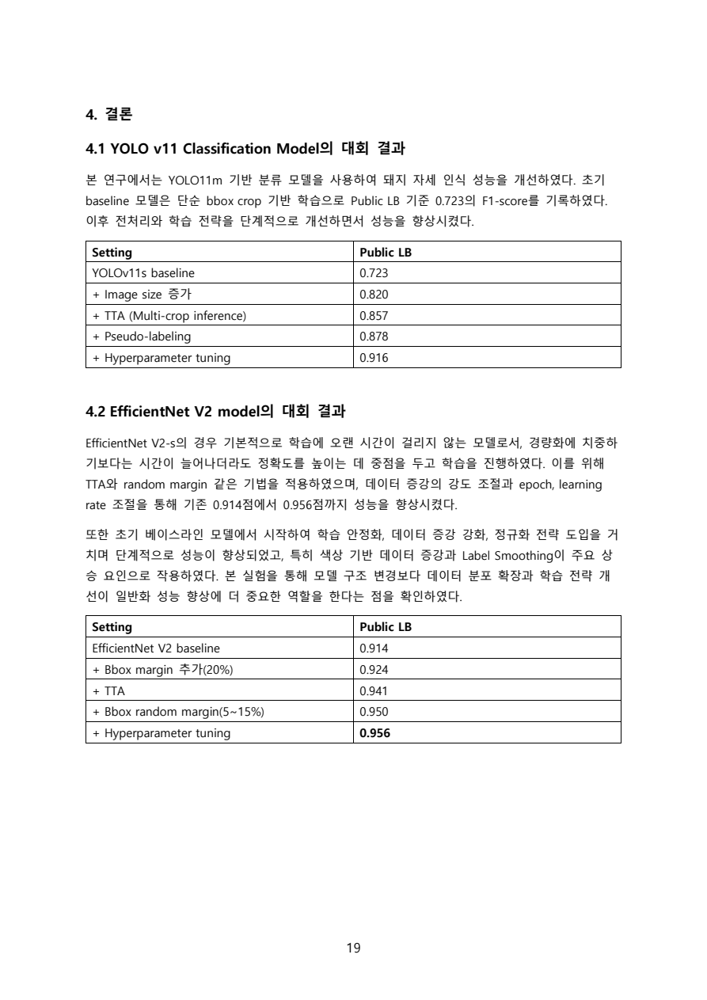
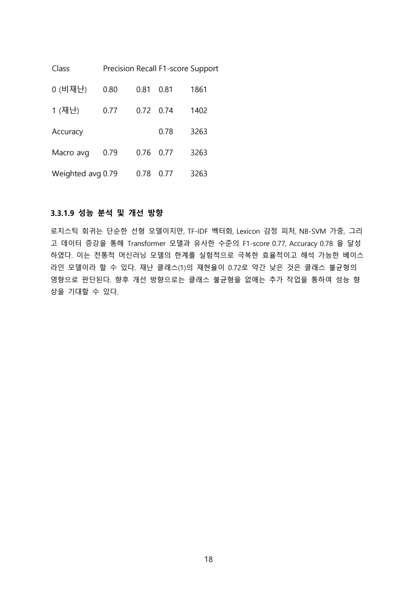

# Kaggle Portfolio

이 저장소는 Kaggle 대회에서 수행한 프로젝트 중, 제가 직접 담당했던 모델링 작업을 포트폴리오 관점에서 정리한 아카이브입니다.

- `Pig Posture Recognition`: YOLO 기반 돼지 자세 분류 모델 담당
- `Natural Language Processing with Disaster Tweets`: Logistic Regression 기반 NLP 분류 모델 담당

현재 저장소에는 대회 보고서 PDF를 중심으로 정리되어 있으며, Kaggle Notebook 링크와 함께 제가 맡았던 실험 흐름과 성과를 한눈에 볼 수 있도록 구성했습니다.

## Summary

| Project | Domain | My Role | Main Model | Verified Result |
| --- | --- | --- | --- | --- |
| Pig Posture Recognition | Computer Vision | YOLO 파트 설계 및 성능 개선 | YOLO11m-cls | Public LB F1 `0.916` |
| NLP with Disaster Tweets | NLP / Text Classification | Logistic Regression 파이프라인 설계 | TF-IDF + Logistic Regression + NB-SVM | Accuracy `0.78`, Macro F1 `0.77` |

## Preview

| Project | Preview |
| --- | --- |
| Pig Posture Recognition |  |
| Disaster Tweets |  |

## 1. Pig Posture Recognition

### Project Overview

돼지의 자세를 이미지로 분류하는 Computer Vision 대회입니다. 배경이 복잡하고, 조명 변화가 크며, 자세 클래스 간 차이가 미묘해서 단순 분류보다 입력 전처리와 추론 전략이 중요한 문제였습니다.

### My Role

저는 이 프로젝트에서 `YOLO 기반 분류 모델` 파트를 맡았습니다.

- Bounding Box 기반 ROI crop 파이프라인 설계
- YOLO11 classification 학습용 데이터 생성
- TTA, pseudo-labeling, 하이퍼파라미터 튜닝을 통한 성능 개선
- 방향성 클래스 혼동 방지를 위한 augmentation 제어

### Model / Experiment Design

핵심 아이디어는 "원본 전체 이미지"보다 "돼지 객체 중심 입력"에 집중하도록 만드는 것이었습니다.

- `YOLO11m-cls` 기반 전이학습 사용
- `train.csv`의 bbox 정보를 활용해 row 단위 crop 이미지 생성
- bbox 주변 정보를 일부 살리기 위해 `PAD=0.10` 확장 적용
- 비율 왜곡을 줄이기 위해 `letterbox + 평균색 padding` 적용
- `Lateral_left / Lateral_right`와 같은 방향성 레이블 보호를 위해 `flip` 비활성화
- `K-Fold` 학습과 `Multi-crop TTA` 적용
- Sitting 클래스 약세 보완을 위한 약한 oversampling / augmentation 적용
- 이후 `pseudo-labeling`, `hyperparameter tuning`까지 확장

### Performance

대회 평가지표는 클래스별 F1을 동일 가중치로 평균한 `macro F1` 계열 지표입니다. 아래 점수는 보고서에서 확인 가능한 `Public Leaderboard` 기준입니다.

| Setting | Public LB |
| --- | --- |
| YOLOv11s baseline | `0.723` |
| + Image size increase | `0.820` |
| + TTA (Multi-crop inference) | `0.857` |
| + Pseudo-labeling | `0.878` |
| + Hyperparameter tuning | `0.916` |

### Why This Work Matters

이 프로젝트에서는 단순히 모델만 바꾼 것이 아니라, 실제 성능 향상에 더 직접적인 영향을 주는 `입력 구성`, `클래스 특성에 맞는 augmentation 설계`, `추론 안정화 전략`을 주도적으로 다뤘습니다. 특히 좌우 방향이 의미를 가지는 클래스에서 일반적인 flip augmentation이 오히려 label noise를 만들 수 있다는 점을 고려해 설정을 조정한 부분이 실무적으로도 의미 있는 판단이었습니다.

### Links

- Kaggle Notebook: [Pig Posture Recognition YOLO](https://www.kaggle.com/code/byeongsunmoon/pig-posture-recognition-yolo)
- Report: [Kaggle Pig Posture Recognition대회 보고서.pdf](<./Kaggle Pig Posture Recognition대회 보고서.pdf>)

## 2. Natural Language Processing with Disaster Tweets

### Project Overview

트윗이 실제 재난 상황을 설명하는지 여부를 판별하는 NLP 이진 분류 대회입니다. 짧은 문장 안에 축약어, 해시태그, 중의적 표현, 잡음이 섞여 있어 전처리와 feature engineering의 영향이 큰 과제였습니다.

### My Role

저는 이 프로젝트에서 `Logistic Regression 기반 분류 파이프라인`을 담당했습니다.

- TF-IDF 벡터화 설계
- Lexicon 기반 감정 피처 결합
- NB-SVM 하이브리드 가중 적용
- Back Translation 기반 데이터 증강 적용
- 전통 ML 기반 baseline을 해석 가능하고 강한 모델로 고도화

### Model / Experiment Design

딥러닝 모델과 별도로, 적은 비용으로도 강한 성능을 내는 해석 가능한 NLP baseline을 만드는 데 집중했습니다.

- `TF-IDF` 벡터화
- `ngram_range=(1, 3)`로 unigram, bigram, trigram 반영
- `min_df=3`, `sublinear_tf=True` 설정
- 상위 `8,000`개 단어 기반 `Lexicon` 점수 추가
- `NB-SVM` 방식으로 단어의 재난 관련도 가중 반영
- `Pseudo Back-Translation`으로 재난 클래스 데이터 증강
- `scikit-learn LogisticRegression` + `L2 regularization` 사용

### Performance

대회 평가지표는 `F1 Score`입니다. 아래 수치는 보고서에서 확인 가능한 Logistic Regression 파트 성능입니다.

| Metric | Result |
| --- | --- |
| Accuracy | `0.78` |
| Macro F1 | `0.77` |
| Weighted F1 | `0.77` |
| Disaster class F1 | `0.74` |
| Disaster class Recall | `0.72` |

추가로 보고서 기준, `NB-SVM` 가중 적용은 F1-score를 약 `+0.03` 개선하는 효과가 있었습니다.

### Why This Work Matters

이 작업의 강점은 단순히 Logistic Regression을 사용한 것이 아니라, `텍스트 전처리`, `feature engineering`, `클래스 불균형 완화`, `확률 기반 가중 설계`를 결합해 전통적 머신러닝 모델의 한계를 실험적으로 밀어 올렸다는 점입니다. 결과적으로 복잡한 딥러닝 모델 대비 비용이 낮고 해석 가능성이 높은 강한 baseline을 구축했습니다.

### Links

- Kaggle Notebook: [Basic NLP on Disaster Tweets](https://www.kaggle.com/code/byeongsunmoon/basic-nlp-on-disaster-tweets)
- Report: [Kaggle Natural Language Processing with Disaster Tweets 대회 보고서(11.30.18h).pdf](<./Kaggle Natural Language Processing with Disaster Tweets 대회 보고서(11.30.18h).pdf>)

## Portfolio Notes

- 이 저장소의 설명은 `제가 직접 담당한 파트`를 중심으로 정리했습니다.
- 점수는 현재 저장소에 포함된 보고서와 공개 Kaggle 메타데이터에서 확인 가능한 범위만 반영했습니다.
- `Pig Posture Recognition`의 경우 YOLO 파트 기준 성능 향상 과정을 명시했습니다.
- `Disaster Tweets`의 경우 Logistic Regression 파트의 구현 전략과 검증 성능을 중심으로 정리했습니다.

## Files

- [README.md](./README.md)
- [Kaggle Pig Posture Recognition대회 보고서.pdf](<./Kaggle Pig Posture Recognition대회 보고서.pdf>)
- [Kaggle Natural Language Processing with Disaster Tweets 대회 보고서(11.30.18h).pdf](<./Kaggle Natural Language Processing with Disaster Tweets 대회 보고서(11.30.18h).pdf>)
