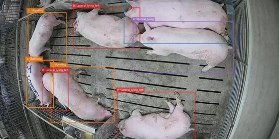

# Kaggle Portfolio

Kaggle 대회에서 진행한 프로젝트 중, 제가 직접 맡았던 모델링 작업을 포트폴리오 관점에서 다시 정리한 저장소입니다.

- `Pig Posture Recognition`: YOLO 기반 돼지 자세 분류 모델 담당
- `Natural Language Processing with Disaster Tweets`: Logistic Regression 기반 NLP 분류 모델 담당

저장소에는 대회 보고서 PDF, Kaggle Notebook 링크, 그리고 제가 맡은 파트의 실험 흐름과 성과를 한눈에 볼 수 있도록 정리한 README가 포함되어 있습니다.

## Summary

| Project | Domain | My Role | Main Model | Verified Result |
| --- | --- | --- | --- | --- |
| Pig Posture Recognition | Computer Vision | YOLO 파트 설계 및 성능 개선 | YOLO11m-cls | Public LB F1 `0.916` |
| NLP with Disaster Tweets | NLP / Text Classification | Logistic Regression 파이프라인 설계 | TF-IDF + Logistic Regression + NB-SVM | Accuracy `0.78`, Macro F1 `0.77` |

## Project Preview

| Project | Competition Header | Result Preview |
| --- | --- | --- |
| Pig Posture Recognition |  |  |
| Disaster Tweets |  |  |

## 1. Pig Posture Recognition

### Official Competition Snapshot

- Competition: [Pig Posture Recognition](https://www.kaggle.com/competitions/pig-posture-recognition)
- Official description: `A Computer Vision Challenge in Precision Livestock Farming (PLF)`
- Task: 돼지의 자세를 이미지 단위로 분류하는 computer vision 문제
- My role: `YOLO 기반 classification pipeline` 설계 및 성능 개선

### Dataset Snapshot

보고서와 대회 데이터 구조를 기준으로 보면, 이 프로젝트는 bbox 기반 객체 중심 분류가 핵심인 과제였습니다.

| Item | Details |
| --- | --- |
| Input | 돼지 이미지와 `train.csv`의 bbox 정보 |
| Sample unit | `row_id` 단위 crop 이미지 |
| Train split | 전체 이미지의 약 70%, `2,164`장 |
| Instances in train split | `16,062`개 인스턴스 |
| Label structure | 자세 분류용 다중 클래스 |
| Notable classes in my work | `Lateral_left`, `Lateral_right`, `Sitting` 등 |

### Evaluation

대회 평가는 각 자세 클래스별 `F1 score`를 독립적으로 계산한 뒤, 클래스 빈도와 관계없이 동일 가중치로 평균하는 방식입니다. 클래스 불균형이 존재하는 데이터셋이라, 단순 정확도보다 클래스별 균형 잡힌 분류 성능이 더 중요했습니다.

### My Approach

핵심 아이디어는 "원본 전체 이미지"보다 "돼지 객체 중심 입력"에 집중하도록 만드는 것이었습니다.

- `YOLO11m-cls` 기반 전이학습 사용
- `train.csv`의 bbox 정보를 활용해 row 단위 crop 이미지 생성
- bbox 주변 정보를 일부 살리기 위해 `PAD=0.10` 확장 적용
- 비율 왜곡을 줄이기 위해 `letterbox + 평균색 padding` 적용
- `Lateral_left / Lateral_right` 같은 방향성 클래스 보호를 위해 `flip` 비활성화
- `K-Fold` 학습과 `Multi-crop TTA` 적용
- Sitting 클래스 약세 보완을 위한 약한 oversampling / augmentation 적용
- 이후 `pseudo-labeling`, `hyperparameter tuning`까지 확장

### Performance

아래 수치는 현재 저장소에 포함된 보고서에서 확인 가능한 `Public Leaderboard` 기준입니다.

| Setting | Public LB |
| --- | --- |
| YOLOv11s baseline | `0.723` |
| + Image size increase | `0.820` |
| + TTA (Multi-crop inference) | `0.857` |
| + Pseudo-labeling | `0.878` |
| + Hyperparameter tuning | `0.916` |

### Why This Work Matters

이 프로젝트에서는 단순히 모델만 바꾼 것이 아니라, 실제 성능에 더 직접적인 영향을 주는 `입력 구성`, `클래스 특성에 맞는 augmentation 설계`, `추론 안정화 전략`을 주도적으로 다뤘습니다. 특히 좌우 방향이 의미를 가지는 클래스에서 일반적인 flip augmentation이 오히려 label noise를 만들 수 있다는 점을 고려해 설정을 조정한 부분이 실무적으로도 의미 있는 판단이었습니다.

### Links

- Kaggle Competition: [Pig Posture Recognition](https://www.kaggle.com/competitions/pig-posture-recognition)
- Kaggle Notebook: [Pig Posture Recognition YOLO](https://www.kaggle.com/code/byeongsunmoon/pig-posture-recognition-yolo)
- Report: [Kaggle Pig Posture Recognition대회 보고서.pdf](<./Kaggle Pig Posture Recognition대회 보고서.pdf>)

## 2. Natural Language Processing with Disaster Tweets

### Official Competition Snapshot

- Competition: [Natural Language Processing with Disaster Tweets](https://www.kaggle.com/competitions/nlp-getting-started)
- Official description: `Predict which Tweets are about real disasters and which ones are not`
- Task: 재난 관련 트윗 여부를 분류하는 binary text classification 문제
- My role: `Logistic Regression 기반 NLP baseline` 설계 및 고도화

### Dataset Snapshot

보고서 기준 이 대회 데이터는 짧은 트윗 텍스트를 중심으로 구성되어 있고, 일부 보조 컬럼과 이진 레이블을 함께 제공합니다.

| Item | Details |
| --- | --- |
| Train samples | `7,613` |
| Test samples | `3,263` |
| Input columns | `id`, `keyword`, `location`, `text` |
| Target | `target` (`1`: 재난, `0`: 비재난) |
| Data characteristics | 축약어, 해시태그, 중의적 표현, 위치 정보 결측 등 |

### Evaluation

대회 평가지표는 `F1 Score`입니다. 재난 트윗 탐지에서는 false negative와 false positive를 함께 관리해야 해서, 단순 accuracy보다 precision과 recall의 균형이 중요한 문제였습니다.

### My Approach

딥러닝 모델과 별도로, 적은 비용으로도 강한 성능을 내는 해석 가능한 NLP baseline을 만드는 데 집중했습니다.

- `TF-IDF` 벡터화
- `ngram_range=(1, 3)`로 unigram, bigram, trigram 반영
- `min_df=3`, `sublinear_tf=True` 설정
- 상위 `8,000`개 단어 기반 `Lexicon` 점수 추가
- `NB-SVM` 방식으로 단어의 재난 관련도 가중 반영
- `Pseudo Back-Translation`으로 재난 클래스 데이터 증강
- `scikit-learn LogisticRegression` + `L2 regularization` 사용

### Performance

아래 수치는 현재 저장소에 포함된 보고서에서 확인 가능한 Logistic Regression 파트 성능입니다.

| Metric | Result |
| --- | --- |
| Accuracy | `0.78` |
| Macro F1 | `0.77` |
| Weighted F1 | `0.77` |
| Disaster class F1 | `0.74` |
| Disaster class Recall | `0.72` |

추가로 보고서 기준, `NB-SVM` 가중 적용은 F1-score를 약 `+0.03` 개선하는 효과가 있었습니다.

### Why This Work Matters

이 작업의 강점은 단순히 Logistic Regression을 사용한 것이 아니라, `텍스트 전처리`, `feature engineering`, `클래스 불균형 완화`, `확률 기반 가중 설계`를 결합해 전통적 머신러닝 모델의 한계를 실험적으로 밀어 올렸다는 점입니다. 결과적으로 복잡한 딥러닝 모델 대비 비용이 낮고 해석 가능성이 높은 강한 baseline을 구축했습니다.

### Links

- Kaggle Competition: [Natural Language Processing with Disaster Tweets](https://www.kaggle.com/competitions/nlp-getting-started)
- Kaggle Notebook: [Basic NLP on Disaster Tweets](https://www.kaggle.com/code/byeongsunmoon/basic-nlp-on-disaster-tweets)
- Report: [Kaggle Natural Language Processing with Disaster Tweets 대회 보고서(11.30.18h).pdf](<./Kaggle Natural Language Processing with Disaster Tweets 대회 보고서(11.30.18h).pdf>)

## Portfolio Notes

- 이 저장소 설명은 `제가 직접 담당한 파트`를 중심으로 정리했습니다.
- 공식 대회 설명과 헤더 이미지는 각 Kaggle competition 페이지를 참고했습니다.
- 데이터셋 구조와 평가 지표 설명은 현재 저장소의 보고서와 대회 페이지 정보를 바탕으로 요약했습니다.
- 점수는 현재 저장소에 포함된 보고서에서 확인 가능한 범위만 반영했습니다.

## Files

- [README.md](./README.md)
- [Kaggle Pig Posture Recognition대회 보고서.pdf](<./Kaggle Pig Posture Recognition대회 보고서.pdf>)
- [Kaggle Natural Language Processing with Disaster Tweets 대회 보고서(11.30.18h).pdf](<./Kaggle Natural Language Processing with Disaster Tweets 대회 보고서(11.30.18h).pdf>)
